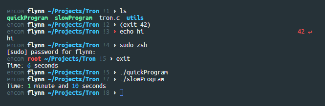
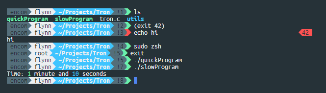
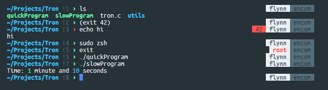
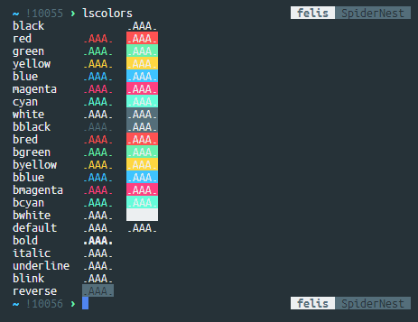

# ZSH Aqua

ZSH Aqua is a ZSH environment configuration which aims to be nice-looking, functional, flexible, and lightweight. ZSH Aqua can be used out of the box with a pre-included theme, or you can make your own theme using ZSH Aqua as a foundation.

## Contents:
- [ZSH Aqua](#zsh-aqua)
    - [Contents:](#contents)
- [Themes](#themes)
    - [Dolphin](#dolphin)
    - [Narwhal](#narwhal)
    - [Stingray](#stingray)
- [Command Tools](#command-tools)
- [Other Environment Features](#other-environment-features)
- [Install ZSH Aqua](#install-zsh-aqua)
- [Color Palette](#color-palette)
- [License](#license)

# Themes

## Dolphin

`themes/dolphin.zsh`



## Narwhal

`themes/narwhal.zsh`



## Stingray

`themes/stingray.zsh`



# Command Tools

| Command | Description |
| -- | -- |
| `alias_value <alias>` | Display what an alias resolves to. |
| `dir` | List directory contents as well as disk usage and repo information. |
| `la` | `ls -a` |
| `catn` | `cat --number` |
| `g` | `grep` |
| `cd..` | `cd ..` |
| `lu [directory=.]` | List file sizes of contents of `directory`. |
| `take <directory>` | Create `directory` and cd into it. |
| `up [n=1]` | Cd up `n` directories. |
| `back` |     Go back to the directory you were previous in. |
| `forward` | Go forward to the directory just backed out of (only remembers the most recent one). |
| `d` | Print the directory history. |
| `check <file>` | Perform md5, sha1, and sha256 checksums on `file`. |
| `getip` | Get computer's public IP address. |
| `genpasswd [length=10]` | Generate random password of length `length`. |
| `tree` | Display directory tree. |
| `zsh_stats` | Display command usage stats from the zsh history. |
| `urlencode [-rmP] <string>` | Url encode `string`.<br/>`-r` causes reserved characters `;/?:@&=+$,` to be escaped<br/>`-m` causes "mark" characters `_.!~*''()-` to be escaped<br/>`-P` causes spaces to be encoded as `%20` instead of `+` |
| `urldecode <string>` | Url decode `string`. |


# Other Environment Features

ZSH Aqua also adds does the following:

- Adds a command timing system. Execution time will be printed if a command takes more than 5 seconds to run.
- Configures zsh completion system.
- Includes system for getting git repo information via the `git_info` function. See [`git.zsh`](lib/git.zsh). Starter `ZSH_THEME_GIT_PROMPT` variables are also set at the top of [`functions.zsh`](lib/functions.zsh).
- ZSH Aqua comes pre-shipped with an `LS_COLORS` configuration.
- Grep config.
- ZSH history config.
- Configured column output for `lsblk`.

Lastly, ZSH Aqua defines terminal colors to make writing themes more user-friendly. Dictionaries `$fg` and `$bg` contain foreground and background colors respectively, and `$fx` contains other formatting codes. Probably easiest just to look at [`style.zsh`](lib/style.zsh).

# Install ZSH Aqua

1. [Install ZSH](box/installzsh.md) if you haven't already, and enter ZSH.
2. Run the following install script. This will install ZSH aqua under `~/.zsh-aqua`.
```bash
cd
if [ -d ".zsh-aqua/" ]
then
    echo "Directory .zsh-aqua/ already exists. Please remove it."
else
    mkdir .zsh-aqua && cd .zsh-aqua
    wget "https://raw.githubusercontent.com/jeremy-rifkin/zsh-aqua/master/bundle.tar.gz"
    tar -xzf bundle.tar.gz && rm bundle.tar.gz
    cd ..
fi
```
Or:
```bash
bash <(curl -s https://raw.githubusercontent.com/jeremy-rifkin/zsh-aqua/master/download.sh)
```

3. Add the following to the top of your `~/.zshrc` file (create it if it doesn't exist). This will load ZSH Aqua when you open a new shell. *(Replace `<theme>` with the theme you want to use)*
```bash
ZSH=~/.zsh-aqua
source $ZSH/aqua.zsh
source $ZSH/themes/<theme>.zsh
```
4. Run `source ~/.zshrc` to load changes, or restart your shell.

# Color Palette

I use the following color palette, and as the pre-included themes might not work with other palettes (although that can be fixed):



Here's the raw hex values:

```javascript
{
    black:   "#263238",
    red:     "#FF5252",
    green:   "#69F0AE",
    yellow:  "#FFD740",
    blue:    "#3FC4FF",
    magenta: "#FF4081",
    cyan:    "#65FCDA",
    white:   "#546E7A",
    lightBlack:   "#546E7A",
    lightRed:     "#FF5252",
    lightGreen:   "#69F0AE",
    lightYellow:  "#FFD740",
    lightBlue:    "#3FC4FF",
    lightMagenta: "#FF4081",
    lightCyan:    "#65FCDA",
    lightWhite:   "#ECEFF1"
}
```

As well as the following terminal configuration:
```javascript
{
    foregroundColor: "#ECEFF1",
    backgroundColor: "#263238",
    selectionColor:  "rgba(135,135,135,0.2)"
}
```


# License

ZSH Aqua is released under the MIT license. See [`LICENSE.txt`](LICENSE.txt).
